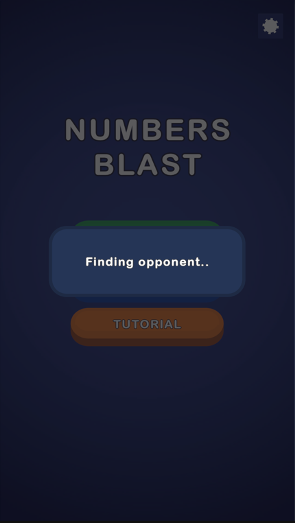

# Numbers Blast

A Block Blast–style number-merge puzzle built for the Mavis **Senior Game Developer Case**.
Blocks carry numbers 1–4; a placed block absorbs its equal-valued neighbours (their sum, with
chain reactions), and full rows/columns clear for score. Part 1 (core game) is complete and
optional Part 2 (fake real-time multiplayer vs a believable AI) is implemented.

<p align="center">
  &nbsp;
  &nbsp;
  &nbsp;
  
</p>

**Engine:** Unity 6000.3.8f1 (6.3 LTS), UGUI + TextMeshPro, new Input System · **Target:** Android, portrait (runs with mouse in the Editor).

## How to run

1. Open this repository in **Unity 6000.3.8f1**.
2. Open `Assets/Scenes/Game.unity` and press **Play**.
3. Tests: *Window ▸ General ▸ Test Runner* — 24 EditMode + 5 PlayMode, all passing.

## Architecture

One assembly; folders mirror namespaces 1:1.

```
Core          Immutable data + enums (MoveResult, MergeStep, GameState, …)
Data          ScriptableObjects (board config, piece shapes, tutorial steps)
Gameplay      Pure logic, UI-free: BoardModel, TrayModel, PlacementService,
              MergeResolver, LineClearResolver, ScoreService, PieceFactory
App           Composition root: GameSessionController + focused session helpers
              (SessionHud, GameOverSequence, InputGate) + PlayerProgress
Presentation  Board/piece/tray views, animations, shared placement preview
Input         PieceDragController (UGUI pointer events — mouse and touch share one path)
UI            Menu, scoreboard, turn/timer, tutorial overlay, game-over, matchmaking
Tutorial      3-step forced tutorial controller
Opponent      TurnController (single match loop), turn timer, move evaluator,
              act planner, human-like presentation
Settings      SFX / music / vibration + settings panel
```

**The one pipeline.** `PlacementService.ApplyMove(board, piece, anchor)` — place, resolve all
merges, then clear full lines — is the single source of truth, used by the live drag preview
(on a scratch board), the real move, the AI's candidate evaluation, and the fail-state check.
Preview, AI and reality can never disagree. The pure `Gameplay` layer never references UI or
input types, so the logic boundary is enforced by namespace, not convention.

## Choices

- **Merge before clear**, in a fixed order: write the piece → resolve merges (4-neighbour,
  chaining) → evaluate line clears. A merge can un-fill a line that looked complete — that is
  the rule, and the preview shows it. Merges score nothing; clears score the sum of unique
  cleared values (a row∩column cell counts once).
- **Piece spawning** never puts equal values on adjacent cells inside one piece, so a piece
  can't self-merge on spawn. Tray holds 3 pieces and refills only when empty.
- **Part 2 is an illusion built from small consistencies:** shared board and tray, a fake
  "Finding opponent…" connect, alternating turns with a **visible 20-second countdown on both
  turns** (the opponent's runs in its own tint), a 5% timeout penalty with an on-screen
  "Time's up! −5%" flash, and an opponent that plays entirely on-screen — it picks a piece
  up from the shared tray, hovers candidate cells, hesitates, occasionally misdrops and
  retries, then places.
- **The AI tries to make good moves, not perfect ones.** Every candidate is scored with the
  same move pipeline, then a weighted-random pick over the top candidates keeps it human. An
  in-match rubber-band widens or narrows that selection by the current score gap, so matches
  stay close; an obviously best move (a line clear) is never passed up, and the AI never fakes
  a hover over a cell that would look better than the move it actually makes.
- **Settings never pause the match** — like a real online opponent, the clock keeps running;
  the panel only locks your own input.
- No DI framework, no service locator, no event bus, no unused interfaces — at this scope
  they would be ceremony. Every class in the project is referenced.

## Known issues / notes

- The 3-step tutorial runs on first launch only (persisted); it can be replayed from the menu.
- Merged values beyond the authored 8-colour palette get a stable golden-ratio hue, so high
  merges stay distinct and readable.
- The opponent's turn typically takes ~3–4 seconds; unlucky rolls can stretch it a few seconds
  more, but its action list is finite and always finishes well inside the 20s countdown.

## Future improvements

- A difficulty selector mapped to the AI's rubber-band threshold (already inspector-tunable).
- An optional hard cap on the opponent's turn length.
- Pooling for the floating score labels (clear glows are already pooled).
